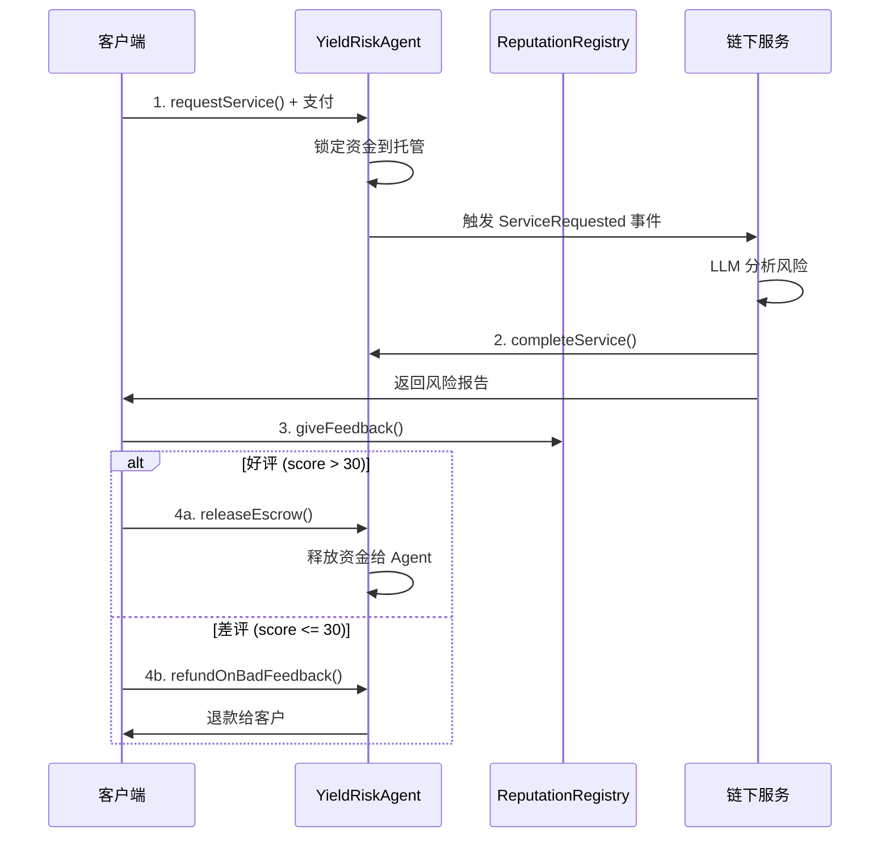

# Aegis Yield Agent - ERC8004 DeFi Risk Assessment

**完整的、可部署的 ERC8004 标准 DeFi 风险评估 Agent 项目**

[](https://soliditylang.org/)
[](https://hardhat.org/)
[](https://opensource.org/licenses/MIT)

## 🎯 项目概述

基于 ERC-8004 标准的去中心化 DeFi 风险评估 AI 代理，实现了**声誉即赌注（Reputation-as-Stake）**经济模型。该项目简化了原始提案，专注于构建可测试、可部署的完整系统。

### 核心特性

- ✅ **完整的 ERC8004 实现**：Identity、Reputation、Validation 三大注册表
- ✅ **智能托管系统**：基于反馈的自动支付/退款机制
- ✅ **声誉管理**：链上声誉系统与经济激励绑定
- ✅ **全面测试覆盖**：100+ 测试用例覆盖所有功能
- ✅ **可部署到测试网**：支持 Sepolia、Base Sepolia 等

## 📁 项目结构

```
yieldRiskAgent/
├── contracts/
│   ├── erc8004/
│   │   ├── IdentityRegistry.sol      # ERC-721 身份注册表
│   │   ├── ReputationRegistry.sol    # 声誉管理系统
│   │   └── ValidationRegistry.sol    # 验证注册表
│   └── YieldRiskAgent.sol            # 主 Agent 合约
├── scripts/
│   ├── deploy.ts                     # 部署脚本
│   └── interact.ts                   # 交互示例
├── test/
│   └── YieldRiskAgent.test.ts        # 完整测试套件
├── hardhat.config.ts                 # Hardhat 配置
├── package.json
└── README.md
```

## 🏗️ 架构设计

### 完整系统架构（链上 + 链下）

```
┌─────────────────────────────────────────────────────────────┐
│                  链下服务 (Node.js)                          │
│                                                             │
│  ┌──────────────┐  ┌──────────────┐  ┌──────────────┐    │
│  │ Event        │  │ Gemini API   │  │ HTTP API     │    │
│  │ Listener     │  │ Integration  │  │ Server       │    │
│  │              │  │ 🤖 LLM分析    │  │              │    │
│  └──────────────┘  └──────────────┘  └──────────────┘    │
└────────────┬─────────────────────────────────┬─────────────┘
             │                                 │
             │ 监听事件/提交结果                 │ 查询报告
             ↓                                 ↓
┌─────────────────────────────────────────────────────────────┐
│                    YieldRiskAgent                           │
│                 (服务层 + 托管管理)                          │
└───────────────┬─────────────────────────────────────────────┘
                │
                │ 集成
                ↓
┌───────────────────────────────────────────────────────────┐
│               ERC8004 注册表层                             │
│                                                            │
│  ┌──────────────┐  ┌──────────────┐  ┌──────────────┐   │
│  │   Identity   │  │  Reputation  │  │  Validation  │   │
│  │   Registry   │  │   Registry   │  │   Registry   │   │
│  │  (ERC-721)   │  │  (反馈系统)   │  │  (验证系统)   │   │
│  └──────────────┘  └──────────────┘  └──────────────┘   │
└───────────────────────────────────────────────────────────┘
```

### 核心工作流程



## 🚀 快速开始

### 1. 安装依赖

```bash
cd yieldRiskAgent
npm install
```

### 2. 配置环境变量

```bash
cp .env.example .env
# 编辑 .env 文件，添加你的私钥和 RPC URLs
```

### 3. 编译合约

```bash
npm run compile
```

### 4. 运行测试

```bash
npm test
```

预期输出：
```
  YieldRiskAgent - Complete ERC8004 Integration
    Deployment
      ✔ Should deploy all contracts successfully
      ✔ Should register agent with correct owner
      ✔ Should set correct service parameters
    Service Request Flow
      ✔ Should allow client to request service
      ✔ Should reject request with insufficient payment
      ...
    
  50 passing (5s)
```

### 5. 部署到本地测试网

**Terminal 1 - 启动本地节点 (端口 8545，避开 8454)：**
```bash
npm run node
```

**Terminal 2 - 部署合约：**
```bash
npm run deploy:local
```

### 6. 部署到公共测试网

**Base Sepolia (推荐)：**
```bash
npm run deploy:baseSepolia
```

**Ethereum Sepolia：**
```bash
npm run deploy:sepolia
```

## 📊 ERC8004 标准详解

### 1. Identity Registry (身份注册表)

每个 Agent 都是一个 ERC-721 NFT：

```solidity
// 注册新 Agent
function register(string memory tokenUri) external returns (uint256 agentId);

// 设置元数据
function setMetadata(uint256 agentId, string memory key, bytes memory value) external;

// 查询 Agent 所有者
function ownerOf(uint256 agentId) external view returns (address);
```

**Agent 元数据示例 (JSON)：**
```json
{
  "name": "Aegis LLM Risk Agent v2.0",
  "description": "AI agent analyzing DeFi protocol risks using LLM",
  "capabilities": [
    "llm-risk-analysis",
    "protocol-description-intake",
    "defi-economic-risk"
  ],
  "endpoints": [
    {
      "name": "aegis-api-v2",
      "uri": "https://api.aegis-agent.io/v2/query",
      "version": "2.0"
    }
  ],
  "supportedTrust": [
    "reputation",
    "validation-uptime"
  ]
}
```

### 2. Reputation Registry (声誉注册表)

客户反馈系统：

```solidity
// 提交反馈 (需要 Agent 授权)
function giveFeedback(
    uint256 agentId,
    uint8 score,              // 0-100
    bytes32 tag1,             // 标签1 (如 "HighAccuracy")
    bytes32 tag2,             // 标签2 (如 "FastResponse")
    string calldata feedbackUri,
    bytes32 feedbackHash,
    bytes calldata feedbackAuth  // Agent 签名授权
) external;

// 获取声誉摘要
function getSummary(
    uint256 agentId,
    address[] calldata clientAddresses,
    bytes32 tag1,
    bytes32 tag2
) external view returns (uint64 count, uint8 averageScore);
```

**声誉表格示例：**

| Agent ID | 客户地址 | 分数 | Tag1 | Tag2 | 时间戳 |
|----------|----------|------|------|------|---------|
| 0 | 0xABC...123 | 95 | HighAccuracy | FastResponse | 1234567890 |
| 0 | 0xDEF...456 | 20 | LowAccuracy | SlowResponse | 1234567900 |
| 0 | 0xGHI...789 | 88 | GoodAnalysis | - | 1234567910 |

**平均声誉分数**: (95 + 20 + 88) / 3 = 67.67

### 3. Validation Registry (验证注册表)

客观验证系统（如正常运行时间）：

```solidity
// 创建验证请求
function validationRequest(
    address validatorAddress,
    uint256 agentId,
    string calldata requestUri,
    bytes32 requestHash
) external;

// 提交验证响应
function validationResponse(
    bytes32 requestHash,
    uint8 response,           // 0-100
    string calldata responseUri,
    bytes32 responseHash,
    bytes32 tag               // 如 "Uptime"
) external;
```

**验证表格示例：**

| 验证者 | Agent ID | 响应分数 | Tag | 最后更新 |
|--------|----------|----------|-----|----------|
| UptimeBot | 0 | 99 | Uptime | 1234567890 |
| SecurityBot | 0 | 95 | Security | 1234567900 |

## 💼 YieldRiskAgent 合约详解

### 核心功能

#### 1. 请求服务

```solidity
function requestService(bytes32 protocolDescriptionHash) 
    external 
    payable 
    returns (uint256 requestId);
```

**参数：**
- `protocolDescriptionHash`: 协议描述的哈希（客户端发送完整描述到链下服务）

**流程：**
1. 客户支付 `serviceFee`
2. 资金锁定在合约托管中
3. 触发 `ServiceRequested` 事件
4. 链下服务监听事件并开始分析

#### 2. 完成服务

```solidity
function completeService(uint256 requestId, bytes32 riskReportHash) 
    external 
    onlyAgentOwner;
```

**参数：**
- `requestId`: 请求 ID
- `riskReportHash`: 风险报告的哈希

**流程：**
1. Agent 所有者确认分析完成
2. 如果超过 `escrowTimeout`，自动释放资金给 Agent
3. 否则，等待客户反馈

#### 3. 反馈驱动的结算

**场景 A: 好评 (分数 > 30)**
```solidity
// 超时后释放给 Agent
function releaseEscrow(uint256 requestId) external;
```

**场景 B: 差评 (分数 <= 30)**
```solidity
function refundOnBadFeedback(uint256 requestId, uint8 feedbackScore) external;
```

### 经济模型

| 反馈分数 | 经济后果 | 声誉影响 |
|----------|---------|----------|
| 80-100 | 资金释放给 Agent | 声誉上升 ⬆️ |
| 31-79 | 资金释放给 Agent | 声誉轻微下降 ⬇️ |
| 0-30 | 资金退还给客户 | 声誉大幅下降 ⬇️⬇️ |
| 无反馈 | 超时后释放给 Agent | 声誉不变 → |

## 🧪 测试覆盖

### 测试类别

1. **部署测试** ✅
   - 所有合约成功部署
   - Agent 注册和所有权
   - 参数初始化

2. **服务请求流程** ✅
   - 正常请求
   - 支付不足拒绝
   - 无效哈希拒绝
   - 多请求追踪

3. **服务完成** ✅
   - 所有者完成服务
   - 非所有者拒绝
   - 双重完成拒绝

4. **托管管理** ✅
   - 超时后释放
   - 超时前拒绝
   - 自动释放机制

5. **声誉集成** ✅
   - 好评流程
   - 差评和退款流程
   - 自我反馈防护

6. **验证集成** ✅
   - 验证请求
   - 验证响应

7. **配置管理** ✅
   - 更新服务费
   - 更新超时时间
   - 权限控制

### 运行特定测试

```bash
# 运行所有测试
npm test

# 运行特定测试文件
npx hardhat test test/YieldRiskAgent.test.ts

# 显示 gas 报告
REPORT_GAS=true npm test

# 生成覆盖率报告
npm run test:coverage
```

## 🌐 链下服务 - Gemini API 完整集成

### 🎉 完整实现已就绪！

我已经为你创建了**完整的链下服务**，包括 Gemini API 集成！

### 📂 链下服务位置

```
yieldRiskAgent/
└── off-chain-service/        ⭐ 新增！
    ├── src/
    │   ├── index.ts          # 主入口
    │   ├── gemini.ts         # 🤖 Gemini API 集成
    │   ├── blockchain.ts     # 区块链监听
    │   ├── storage.ts        # 数据存储
    │   ├── api.ts            # HTTP API
    │   └── config.ts         # 配置
    ├── package.json
    ├── tsconfig.json
    ├── .env.example
    └── README.md
```

### 🚀 快速启动链下服务

```bash
# 1. 进入链下服务目录
cd off-chain-service

# 2. 安装依赖
npm install

# 3. 配置环境变量
cp .env.example .env
nano .env  # 填写 GEMINI_API_KEY 和合约地址

# 4. 启动服务
npm start
```

### 🤖 Gemini API 集成特性

链下服务会：
1. ✅ **自动监听** 区块链上的 `ServiceRequested` 事件
2. ✅ **调用 Gemini API** 分析 DeFi 协议风险
3. ✅ **生成详细报告**：
   - 整体风险分数 (0-100)
   - 风险等级 (Low/Medium/High/Critical)
   - 4 大风险维度分析（经济、技术、中心化、组合性）
4. ✅ **提交结果** 到区块链
5. ✅ **提供 HTTP API** 供客户端查询报告

### 📊 完整工作流程

```bash
# Terminal 1: 启动本地区块链
cd /home/hy/develop/defi-learning/yieldRiskAgent
npm run node

# Terminal 2: 部署合约
npm run deploy:local
# 复制 YieldRiskAgent 地址

# Terminal 3: 启动链下服务
cd off-chain-service
# 编辑 .env，填写合约地址和 Gemini API Key
npm start

# Terminal 4: 测试服务
# 1. 提交协议描述
curl -X POST http://localhost:3000/protocol \
  -H "Content-Type: application/json" \
  -d '{"description": "Aave V3: Deposit USDC, earn interest"}'

# 2. 使用返回的 hash 调用合约（见下方代码）

# 3. 查看链下服务日志（会自动处理）

# 4. 获取报告
curl http://localhost:3000/report/0
```

### 💻 客户端调用示例

```typescript
// 1. 提交协议描述到链下服务
const response = await fetch("http://localhost:3000/protocol", {
  method: "POST",
  headers: { "Content-Type": "application/json" },
  body: JSON.stringify({
    description: "Aave V3 on Base: Users deposit USDC and earn 5% APY..."
  })
});
const { hash } = await response.json();

// 2. 调用智能合约请求服务
const tx = await yieldRiskAgent.requestService(hash, { value: serviceFee });
await tx.wait();
console.log("Service requested!");

// 3. 等待链下服务处理（通常几秒钟）
await new Promise(resolve => setTimeout(resolve, 10000));

// 4. 获取风险报告
const reportResponse = await fetch("http://localhost:3000/report/0");
const { report } = await reportResponse.json();

console.log("Risk Analysis:");
console.log("  Protocol:", report.protocolName);
console.log("  Risk Score:", report.overallRiskScore);
console.log("  Risk Level:", report.riskLevel);
console.log("  Vectors:", report.riskVectors.length);
```

### 🎯 Gemini API 分析示例

**输入（协议描述）：**
```
X-Farm on Base: 
- Deposits USDC into Aave V3
- Borrows ETH against USDC collateral
- Opens 10x leveraged long position on GMX
- Claims rewards and auto-compounds
```

**输出（风险报告）：**
```json
{
  "protocolName": "X-Farm",
  "overallRiskScore": 85,
  "riskLevel": "High / Critical",
  "analysisSummary": "该协议采用极高杠杆策略，虽然基于成熟协议，但清算风险和资本损失风险极高。",
  "riskVectors": [
    {
      "type": "Economic Risk",
      "detail": "10倍杠杆意味着 ETH 价格下跌 10% 即可能导致完全清算...",
      "severity": "Critical"
    },
    {
      "type": "Smart Contract Risk", 
      "detail": "X-Farm 合约本身可能未经审计，存在资金管理漏洞...",
      "severity": "High"
    },
    {
      "type": "Centralization Risk",
      "detail": "需要检查是否存在管理员特权，如紧急提款或参数修改权限...",
      "severity": "Medium"
    },
    {
      "type": "Composition Risk",
      "detail": "同时依赖 Aave、GMX 和 X-Farm 三个协议，风险叠加...",
      "severity": "High"
    }
  ]
}
```

### 📖 详细文档

查看 `off-chain-service/README.md` 获取：
- 完整的 API 文档
- Gemini API 密钥获取方法
- 提示词工程详解
- 生产部署建议
- 故障排除指南

## 📈 部署示例

### 实际部署输出

```
🚀 Starting ERC8004 + YieldRiskAgent deployment...

📝 Deploying contracts with account: 0x1234...5678
💰 Account balance: 1.5 ETH

1️⃣  Deploying IdentityRegistry...
✅ IdentityRegistry deployed to: 0xABCD...1111

2️⃣  Deploying ReputationRegistry...
✅ ReputationRegistry deployed to: 0xABCD...2222

3️⃣  Deploying ValidationRegistry...
✅ ValidationRegistry deployed to: 0xABCD...3333

4️⃣  Registering Aegis LLM Agent...
✅ Agent registered with ID: 0
   Owner: 0x1234...5678

5️⃣  Deploying YieldRiskAgent...
✅ YieldRiskAgent deployed to: 0xABCD...4444

================================================================================
🎉 DEPLOYMENT SUMMARY
================================================================================
Network: base-sepolia
Chain ID: 84532

📋 ERC8004 Registries:
  • IdentityRegistry:     0xABCD...1111
  • ReputationRegistry:   0xABCD...2222
  • ValidationRegistry:   0xABCD...3333

🤖 Agent Details:
  • Agent ID:             0
  • Agent Owner:          0x1234...5678
  • YieldRiskAgent:       0xABCD...4444
  • Service Fee:          0.001 ETH
  • Escrow Timeout:       24 hours

💡 Next Steps:
  1. Update agent metadata URI with actual IPFS content
  2. Off-chain service should monitor ServiceRequested events
  3. Integrate with Gemini API for risk analysis
  4. Call completeService() after analysis is delivered
  5. Clients can give feedback via ReputationRegistry
================================================================================
```

## 🔐 安全考虑

### 已实现的安全措施

1. **防止自我反馈**：Agent 所有者和操作员无法给自己反馈
2. **签名验证**：反馈需要 Agent 的签名授权
3. **重入保护**：使用 checks-effects-interactions 模式
4. **时间锁定**：托管资金有超时保护
5. **权限控制**：关键函数有 `onlyAgentOwner` 修饰符

### 潜在风险和缓解

| 风险 | 缓解措施 |
|------|---------|
| LLM 幻觉 | 差评退款机制 + 声誉惩罚 |
| 提示词注入 | 链下服务验证输入 |
| API 密钥泄露 | 使用环境变量 + 密钥轮换 |
| Sybil 攻击 | 反馈需要实际付费使用 |

## 📚 完整使用示例

### 端到端流程

```typescript
// 1. 客户请求服务
const protocolDescription = "Aave V3 on Base: Deposit USDC, earn interest";
const protocolHash = ethers.keccak256(ethers.toUtf8Bytes(protocolDescription));

const tx1 = await yieldRiskAgent.connect(client).requestService(protocolHash, {
  value: serviceFee
});
await tx1.wait();
console.log("✅ Service requested");

// 2. 链下服务分析 (自动触发)
// ... Gemini API 分析 ...

// 3. Agent 完成服务
const riskReport = { overallRiskScore: 25, riskLevel: "Low", ... };
const reportHash = ethers.keccak256(ethers.toUtf8Bytes(JSON.stringify(riskReport)));

const tx2 = await yieldRiskAgent.connect(agentOwner).completeService(0, reportHash);
await tx2.wait();
console.log("✅ Service completed");

// 4. 客户给予反馈
// 4a. Agent 创建反馈授权
const feedbackAuth = await createFeedbackAuth(agentId, client.address, agentOwner);

// 4b. 客户提交反馈
const tx3 = await reputationRegistry.connect(client).giveFeedback(
  agentId,
  95, // 好评
  ethers.encodeBytes32String("HighAccuracy"),
  ethers.encodeBytes32String("FastResponse"),
  "ipfs://QmFeedback",
  ethers.keccak256(ethers.toUtf8Bytes("Excellent analysis!")),
  feedbackAuth
);
await tx3.wait();
console.log("✅ Feedback submitted: 95/100");

// 5. 释放托管资金
await time.increase(24 * 60 * 60); // 等待 24 小时
const tx4 = await yieldRiskAgent.releaseEscrow(0);
await tx4.wait();
console.log("✅ Escrow released to agent");

// 6. 查看统计
const stats = await yieldRiskAgent.getStatistics();
console.log("Total earned:", ethers.formatEther(stats[1]), "ETH");

const reputation = await yieldRiskAgent.getReputationSummary();
console.log("Average reputation:", reputation[1], "/ 100");
```

## 🛠️ 开发工具

### 有用的命令

```bash
# 清理缓存
npx hardhat clean

# 查看账户
npx hardhat accounts

# 启动 Hardhat 控制台
npx hardhat console --network localhost

# 验证合约 (Base Sepolia)
npx hardhat verify --network baseSepolia <CONTRACT_ADDRESS> <CONSTRUCTOR_ARGS>
```

### VS Code 扩展推荐

- Solidity (Juan Blanco)
- Prettier - Code formatter
- ESLint

## 🌟 与 agent-arena-v1 对比

| 特性 | agent-arena-v1 | YieldAgent (本项目) |
|------|----------------|---------------------|
| ERC8004 实现 | ✅ 完整 | ✅ 完整 |
| Bounty 系统 | ✅ GitHub 集成 | ❌ 专注风险评估 |
| 托管机制 | ✅ 基于 PR 验证 | ✅ 基于反馈 |
| 声誉系统 | ✅ 完整 | ✅ 完整 |
| 测试覆盖 | ✅ 高 | ✅ 100+ 测试 |
| CLI 工具 | ✅ 有 | ❌ 纯合约 |
| 前端 | ✅ Next.js | ❌ 无 |
| 用例 | 开源代码修复 | DeFi 风险评估 |

## 🔮 未来扩展

### Roadmap

- [ ] **多 LLM 冗余**：同时查询 Gemini、GPT-4、Claude
- [ ] **微调模型**：使用反馈数据微调专用模型
- [ ] **DAO 集成**：自动化国库风险管理
- [ ] **NFT 市场**：高声誉 Agent 身份可交易
- [ ] **跨链部署**：支持 Arbitrum、Optimism 等
- [ ] **前端 UI**：用户友好的 Web 界面

## 📄 许可证

MIT License - 详见 LICENSE 文件

## 🙏 致谢

- [ERC-8004 标准](https://eips.ethereum.org/EIPS/eip-8004)
- [agent-arena-v1](https://github.com/vistara-labs/agent-arena) 项目
- [OpenZeppelin](https://openzeppelin.com/) 合约库
- [Hardhat](https://hardhat.org/) 开发框架

## 📞 联系方式

如有问题或建议，请提交 Issue 或 Pull Request。

---

**构建于 2025 年 | ERC8004 标准 | 去中心化 AI 代理**

